## Table of contents

1. [Replicating Database locally](#replicating-database-locally-for-testing)
2. [Adding a new node](#adding-a-new-node)
3. [Commonly used commands](#regularly-used-commands)
3. [Connecting to a node in debug mode](#Configuring-remote-interpreter-for-debugging)

### Replicating database locally for testing

#### Steps:

- SSH into the server.
- Login to the database shell and run `SHOW DATABASES;` to check the name of the schema in the database on the server.
- Exit the database shell.
- CD into the "root" directory
- Run `mysqldump schema_name > file_name.sql`
- CD into the directory you want to download the backup file into and run `scp remote_user@remote_ip:file_name.sql .`
- Import the file into a schema in your local database in MySql WorkBench.
- Configure the local schema to your backend settings in dev.py.

### Adding a new node

#### Steps:

- Add a new user to the panel.
- Add a camera against that user in the panel.
- Set latitude and longitude for the node as per its location from google maps.
- Generate a token for the user associated with the new camera.
- SSH into the wwf server and cd into the wwf_snow_leopard directory.
- Run the set_sun_time management command `python manage.py set_sun_times`.

- SSH into the new node from remote.it and install supervisor.
- Create a new configuration file for supervisor by running `sudo nano /etc/supervisor/conf.d/camera_trap.conf`
- Copy the contents of the miscellaneous/camera_trap.conf file present in the camera_trap repo into the newly created configuration file for supervisor.
- Replace the username everywhere in the conf file with the username of the new node and the <Token> with the token of the new node.
- Clone the camera_trap repo onto the node and install the requirements.
- Start supervisor. 

### Configuring remote interpreter for debugging

##### Add new remote interpreter

1. Connect to the node from Remote.it and copy the endpoint. 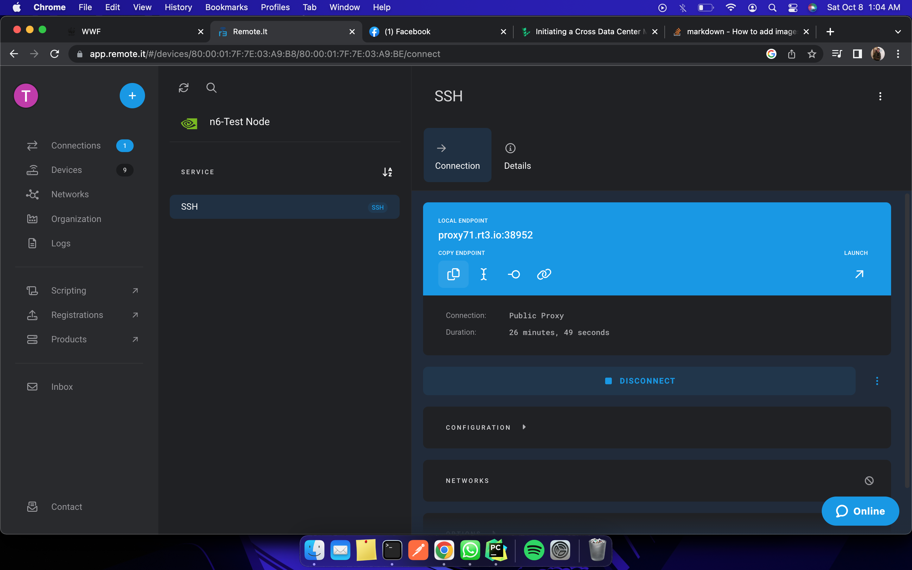
2. Open camera_trap repository in PyCharm.
3. Open Interpreter Settings and add a new SSH interpreter. 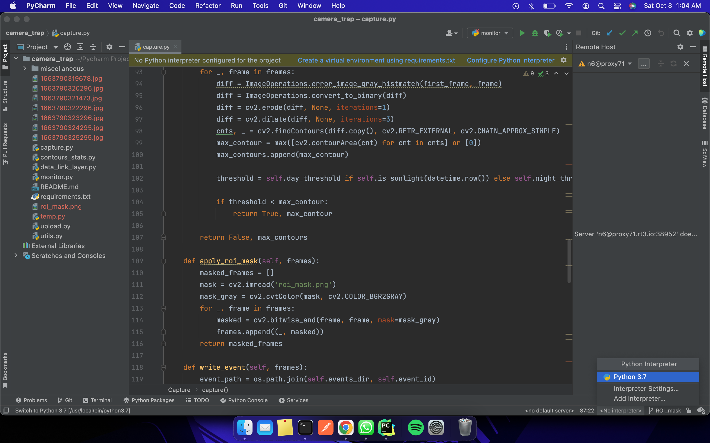 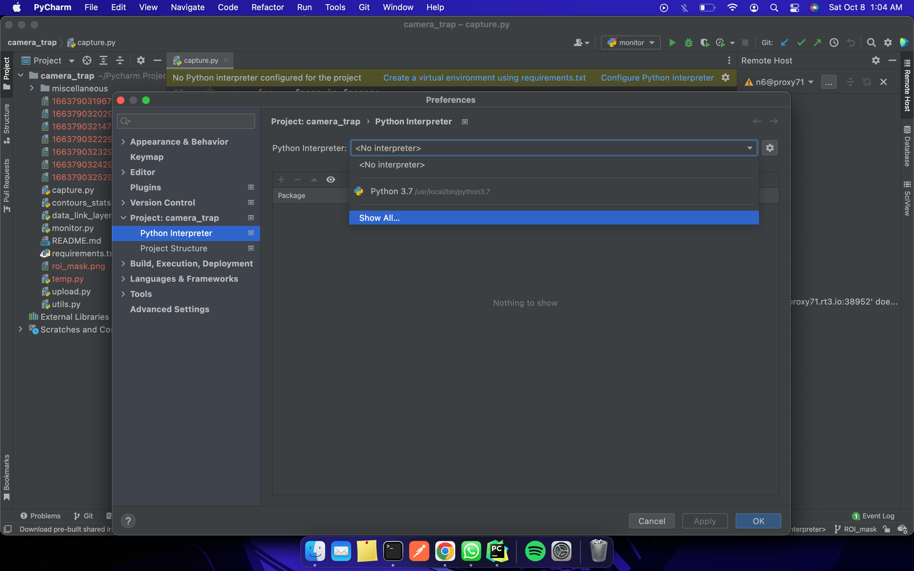 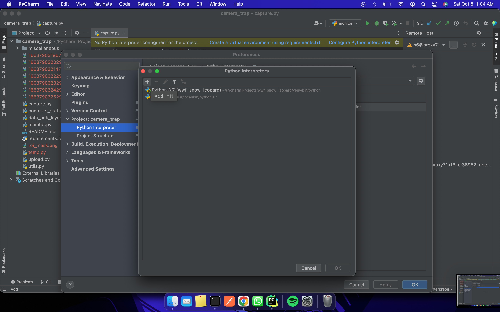 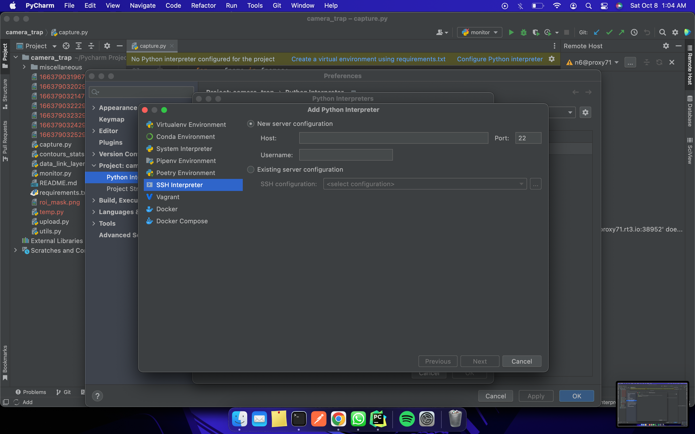 
Provide the end point credentials you copied from remoteit and the password for the node as follows. 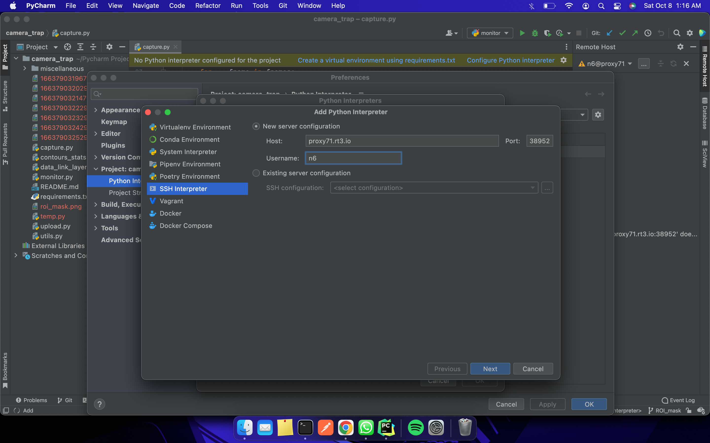 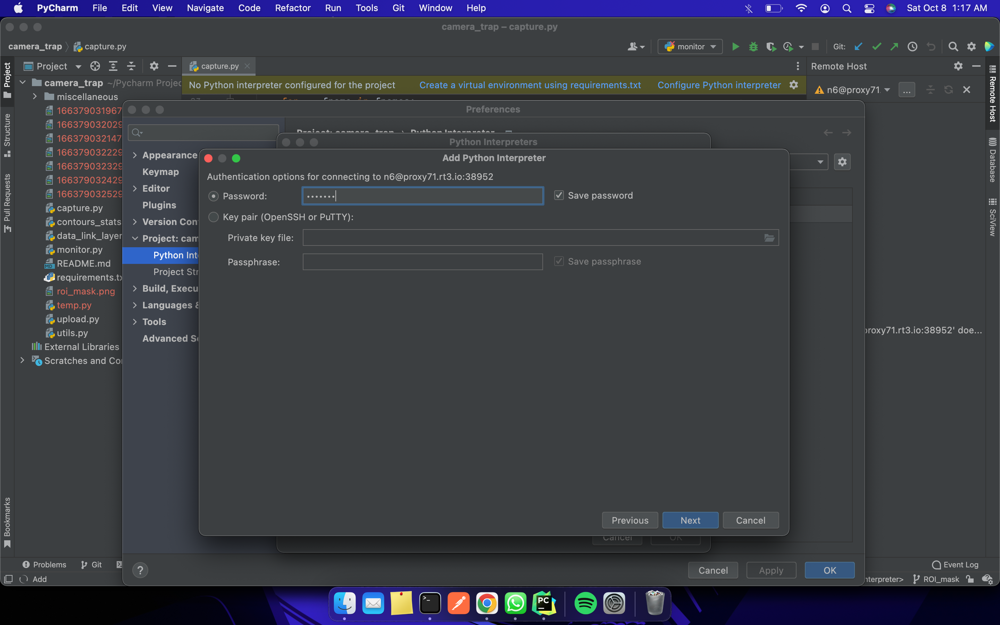
4. Make sure the interpreter is using the appropriate python, in this case, /usr/bin/python3 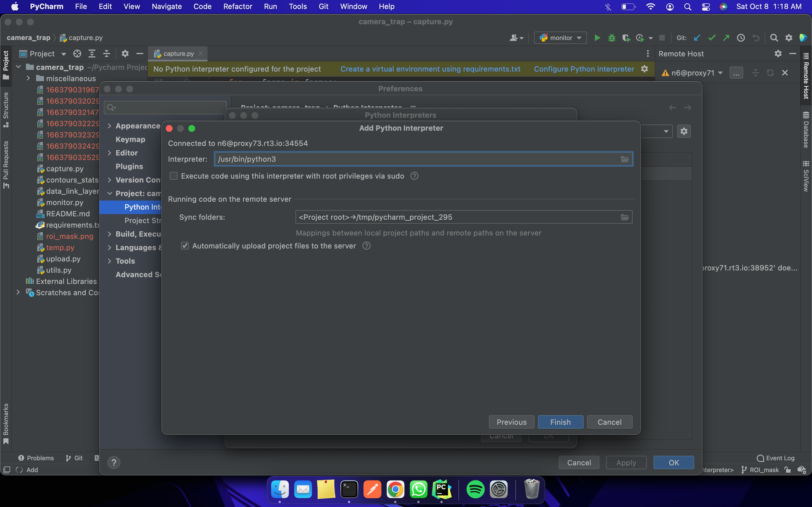 
5. Finish adding the interpreter and apply the changes: 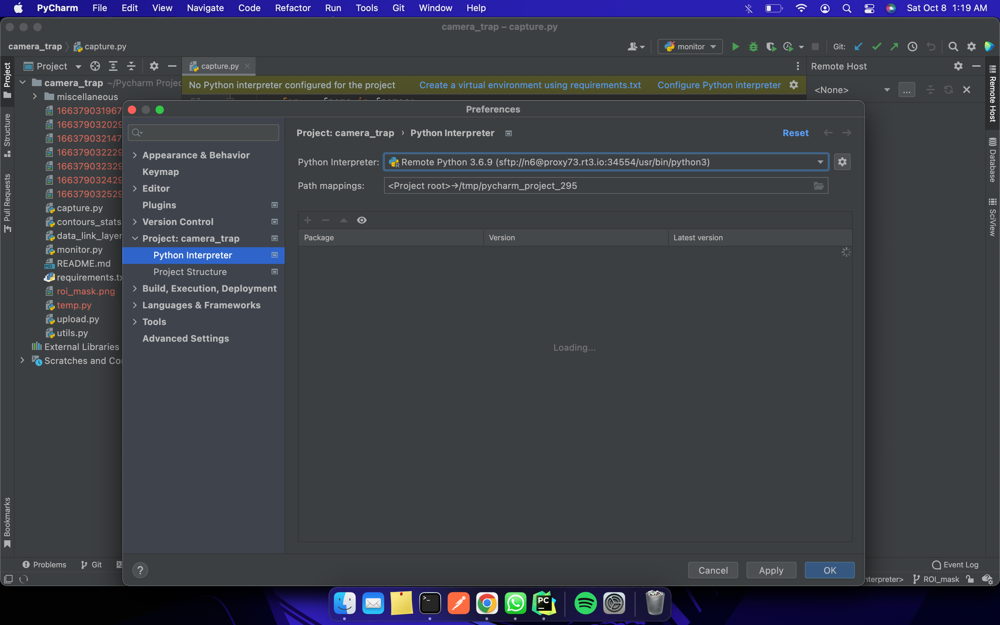

##### Configure Mapping for Deployment

1. Go to Tools > Deployment > Configuration.
2. Choose the new SSH connection created with the camera's endpoint credentials. 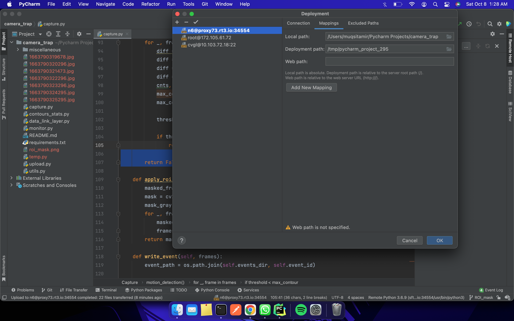
3. Change the deployment path to the camera_trap repository on the server: 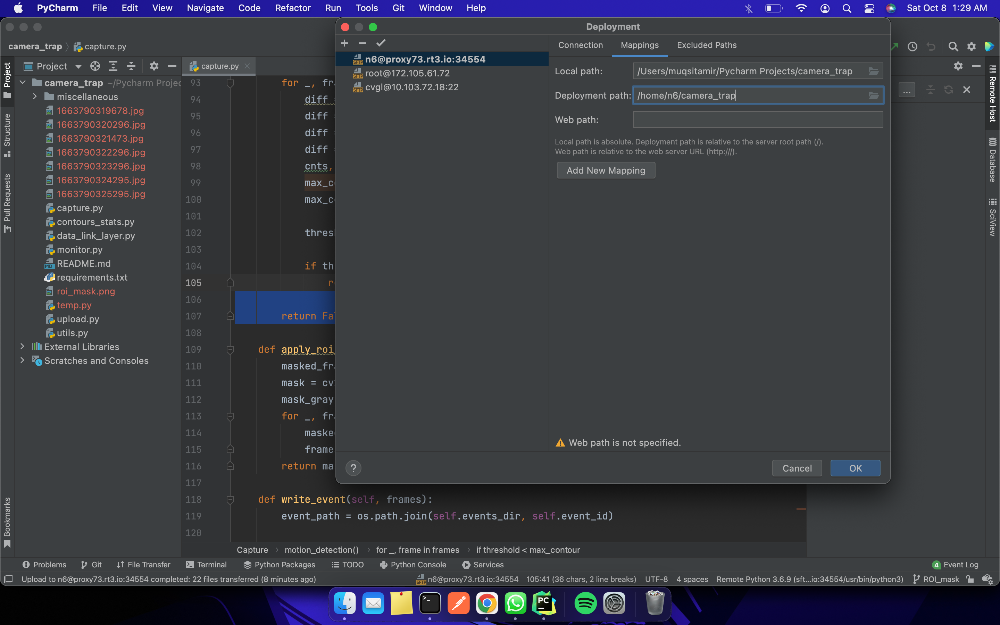
4. Wait for the repo to be synced and the skeletons to be loaded locally.
5. Setup Run/Debug Configurations as follows (you can set environment variables if required in the script) 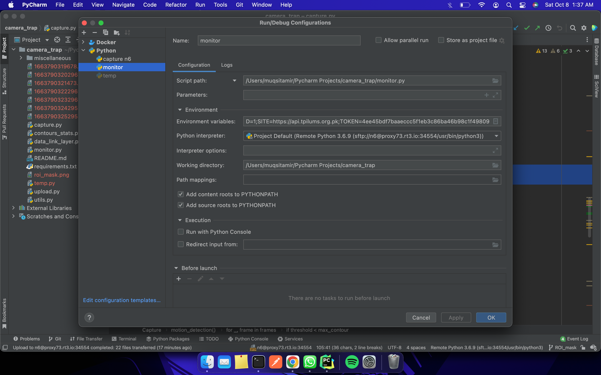

##### Important Note

1. When you run/debug a script remotely using this method, for some reason, it doesn't stop the script properly when done from pycharm, so you will have to kill the process from an SSH session into the node.
2. SSH into the node in question and run `ps ax | grep <script.py>` and it will list the multiple processes running at the same time.
3. You will have to kill them before you can run/debug it again or before supervisor can run the scripts in question.

### Commonly used commands

##### Supervisor 

- `sudo supervisorctl status` - Check the status of scripts running on supervisor
- `sudo service supervisor start` - Start supervisor
- `sudo service supervisor restart` - Restart supervisor
- `sudo service supervisor stop` - Stop supervisor

##### Logs

- `cat /var/log/camera.log | grep -a --text <specify_keyword_here>` - Print all the logs relevant to a certain keyword.
- `tail -f /var/log/camera.log` - Print logs in real time as they are generated.
- `/usr/bin/supervisord -n -c /etc/supervisor/conf.d/camera_trap.conf`